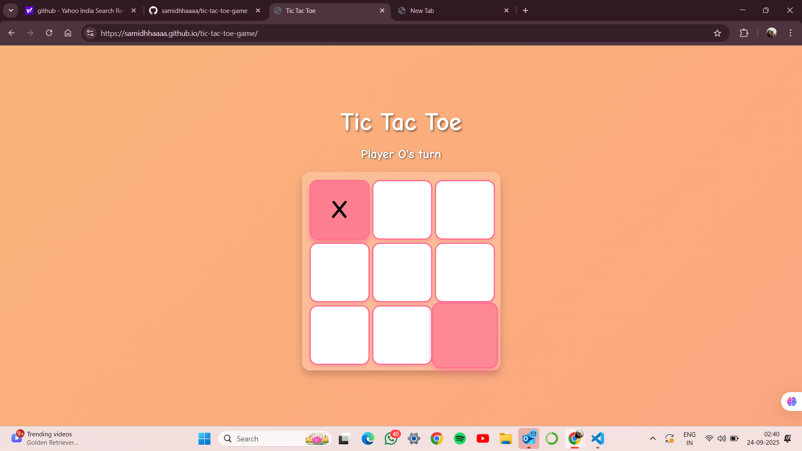
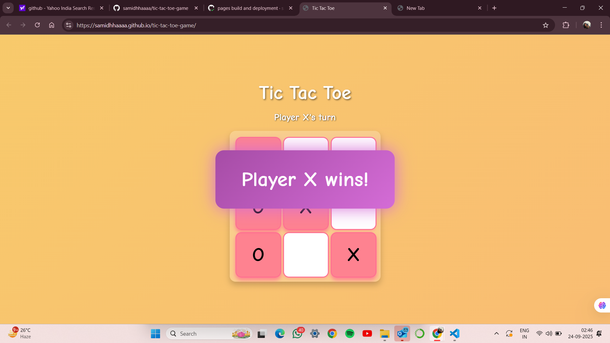

# 🎮 Tic Tac Toe Game

Welcome to my **Tic Tac Toe** project — a fun, colorful, and interactive version of the classic game, built entirely with **HTML, CSS, and JavaScript**.  

👉 **Play it live here:** [Tic Tac Toe Game](https://samidhhaaaa.github.io/tic-tac-toe-game/)

---

## ✨ About the Game 
This project is a colorful and interactive Tic Tac Toe game built using HTML, CSS, and JavaScript. It brings a fresh, vibrant look to the classic 3x3 grid game, making it visually engaging while keeping the rules simple and familiar.

Two players can take turns marking their symbols (X and O) on the board, with the game instantly checking for a winner or a draw. Once a round ends, the board can be reset with a single click, allowing for continuous play. Designed to be lightweight and fully responsive, the game works seamlessly on both desktop and mobile browsers, requiring no installation — just open and play!

---

## 🚀 Features
- 🎨 **Colorful UI** with a playful design  
- 👥 **2-player mode** on the same device  
- 🏆 Detects **winner and draw** instantly  
- 🔄 **Restart option** to play again without reloading  
- 📱 Works on both **desktop and mobile browsers**  

---

## 🧠 Code Logic

The game is implemented using **HTML, CSS, and JavaScript** with the following logic:

1. **Game Board Setup**
   - The board is a 3×3 grid made of `div` elements.
   - Each cell has a `data-index` attribute (0–8) to track its position in the array.

2. **Game State**
   - A `gameBoard` array stores the current state of the board (`''`, `'X'`, or `'O'`).
   - `currentPlayer` keeps track of whose turn it is (`X` or `O`).
   - `gameActive` ensures the game stops after a win or draw.

3. **Player Moves**
   - When a cell is clicked:
     - If it’s empty and the game is active, the current player’s symbol (`X` or `O`) is placed in the cell and stored in the array.
     - The UI updates with colors and animations for better experience.

4. **Win & Draw Detection**
   - The game checks all possible winning combinations (rows, columns, diagonals).
   - If a winning condition is met, a **popup animation** declares the winner.
   - If all cells are filled with no winner, it’s declared a draw.

5. **Turn Switching**
   - After each valid move, the turn switches between **Player X** and **Player O**, and the message updates accordingly.

6. **Game Reset**
   - A reset function clears the board, resets the array, and restarts the game from Player X’s turn.
   - The popup is hidden until the next win.

⚡ In short, the game logic uses an array to track the board state, checks winning conditions after every move, switches turns, and updates the UI dynamically with JavaScript.

---

## 📷 Screenshots

### 🎮 Gameplay
Here’s how the game looks while playing:

### 🏆 Winner Screen
When a player wins, the game shows the result:

---
## 🙌 Thank You
Thanks for checking out my project!  
If you enjoyed it or have suggestions, feel free to ⭐ star the repo or open an issue.  

